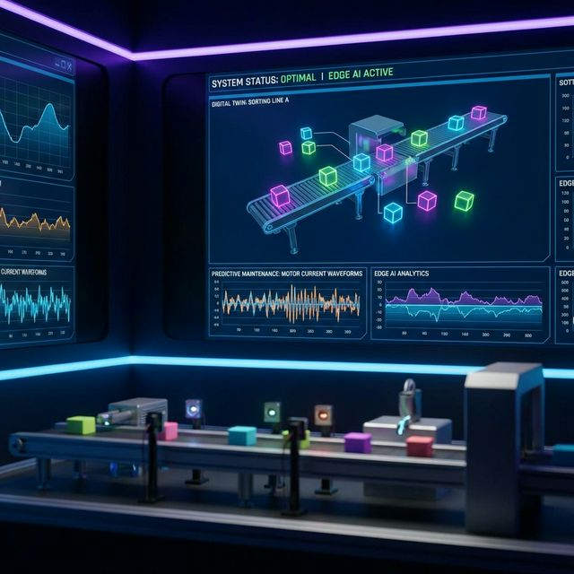

<div align="center">
  
  
  <h1>🏭 Industrial IoT Smart Sorting System: Edge AI & Digital Twin</h1>
  <p><strong>IT/OT Integration: Real-time Computer Vision, Predictive Maintenance & Cloud Telemetry</strong></p>

  <a href="#-arquitectura-del-sistema">Arquitectura</a> •
  <a href="#-capacidades-extendidas-del-sistema">Capacidades del Sistema</a> •
  <a href="#-enfoque-tecnológico">Enfoque Tecnológico</a>
</div>

---

> [!CAUTION]
> **Aviso de Confidencialidad:** Este repositorio contiene la descripción arquitectónica y de diseño de un sistema propietario de clasificación y monitoreo industrial. El código fuente de la lógica de control, los algoritmos de visión artificial y de mantenimiento predictivo no se publican para proteger la propiedad intelectual (IP).

En la manufactura moderna, la latencia entre la detección de un defecto y la actuación mecánica es crítica. Los sistemas tradicionales de visión suelen ser costosos, cerrados y poco integrables. Este proyecto expone una arquitectura propietaria, flexible y de bajo costo/alto rendimiento, capaz de ejecutar clasificación a alta velocidad en el "Edge" y de enviar telemetría a ecosistemas Cloud de forma segura.

## 🏗️ Arquitectura del Sistema

El sistema implementa una arquitectura híbrida *Edge-to-Cloud*, donde el procesamiento pesado (como la inferencia de Inteligencia Artificial) se ejecuta localmente (On-Premise) para garantizar latencia cero, mientras que los datos agregados se sincronizan con la nube para analítica global.

```mermaid
graph TD
    subgraph "Capa Operativa (OT)"
        direction LR
        Camera[Sensor Óptico / Visión]
        Motor[Motor de Cinta Transportadora]
        Actuator[Actuador Electromecánico Rápido]
    end

    subgraph "Nivel Edge (Procesamiento Local)"
        EdgeNode[Controlador Inteligente Edge]
        CV_Model[Modelo de Visión Artificial]
        ML_Model[Motor de Inferencia MCSA]
        ControlLogic[Lógica de Tiempo Real]
    end

    subgraph "Nivel Supervisorio & Nube (IT)"
        DigitalTwin[Digital Twin HMI / Dashboard]
        CloudDB[Cloud Telemetry & ERP Storage]
    end

    Camera -->|Flujo de Video| CV_Model
    Motor -->|Telemetría de Corriente| ML_Model
    
    CV_Model --> ControlLogic
    ML_Model -->|Detección de Anomalías| ControlLogic
    
    ControlLogic -->|Comando de Desvío| Actuator
    
    EdgeNode <-->|WebSockets (Baja Latencia)| DigitalTwin
    EdgeNode -->|Agregación de Datos Segura| CloudDB
```

## 🚀 Capacidades Extendidas del Sistema

El ecosistema cuenta con software de grado industrial, actuando como controlador de planta y panel supervisor (HMI) avanzado:

### 1. 🌐 Web 3D / 2D Digital Twin
- **Simulación y Monitoreo en Tiempo Real:** Dashboard web reactivo conectado por red local industrial al Nodo Edge.
- **Visualización Sincronizada:** Representación gráfica e interactiva de la cinta transportadora y el brazo clasificador actuando instantáneamente sobre el producto, logrando un reflejo virtual (Gemelo Digital) de la física de la planta.

### 2. 🧠 Edge AI: Predictive Maintenance
- **Machine Learning Local:** El controlador ejecuta algoritmos de *Motor Current Signature Analysis (MCSA)*.
- **Osciloscopio IoT:** La interfaz del sistema muestra en vivo los patrones de demanda de energía (amperaje) de los motores.
- **Detección de Anomalías y Fricción:** A través de análisis de firmas, la Inteligencia Artificial detecta fricción anormal o desgaste en rodamientos, emitiendo alertas tempranas (Warnings) y detenciones preventivas *antes* de que ocurra una falla catastrófica, ahorrando tiempo de inactividad (Downtime).

### 3. ☁️ Cloud Telemetry Integrations
- **Sincronización con ERP:** Los contadores de productividad (piezas clasificadas por tipo, mermas, tiempos de ciclo) se procesan y se empujan de forma controlada a bases de datos relacionales/documentales en la nube, optimizando el ancho de banda y permitiendo reportes ejecutivos.

---

## 🛠️ Enfoque Tecnológico

El diseño del sistema se basó en los siguientes pilares tecnológicos y protocolos industriales:

| Capa del Sistema | Enfoque Tecnológico |
|-----------|-------------|
| **Edge Compute Node** | Microprocesador de alto rendimiento para ejecución de redes neuronales y análisis espectral. |
| **Real-Time Controller** | Microcontrolador determinista (RTOS) para actuación de precisión en milisegundos. |
| **Digital Twin HMI** | Interfaces web asíncronas de bajo consumo (Modo Oscuro Industrial) con renderizado dinámico. |
| **Protocolos de Datos** | MQTT para IoT, WebSockets para el Digital Twin, y arquitecturas RESTful para integraciones ERP. |

---
> Elaborado por **Gustavo Matheus** - Ingeniero de Proyecto e Integración de Sistemas.
